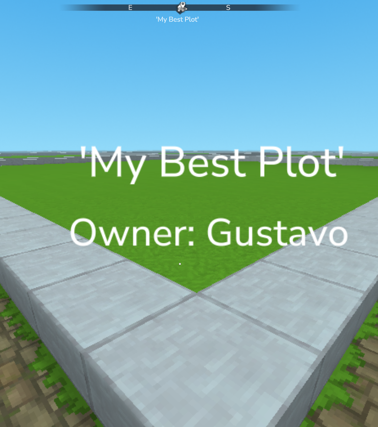

# Changelog

All notable changes to this project will be documented in this file.

## [1.1.0] - 2026-01-20
### Added
- **Holograms Integration**: Added support for [Hylograms](https://www.curseforge.com/hytale/mods/hylograms) to display plot information at the corner of claimed plots.
  
  
  
- **Java 25 Support**: Successfully updated the project toolchain to Java 25.
- **Update Checker**: Admins are now notified when joining the server if a new version is available on GitHub.

### Changed
- **Redundant Logic**: Removed multiple redundant permission checks across all subcommand classes.

### Removed
- **Cleaned Up**: Removed unused imports and deprecated logic in various command files.

### Fixed
- **Permission Validation**: Fixed a critical issue where permissions were not being correctly validated, preventing non-OP players from using commands.
- **Translations**: Replaced hardcoded "player-only" error messages with the `general.only_players` translation key.

## [1.0.0] - 2026-01-15
### Added
- Initial release of the Plots plugin with fundamental land management features.
- Dynamic generation system with prefab support.
- Granular protection and masking logic.
