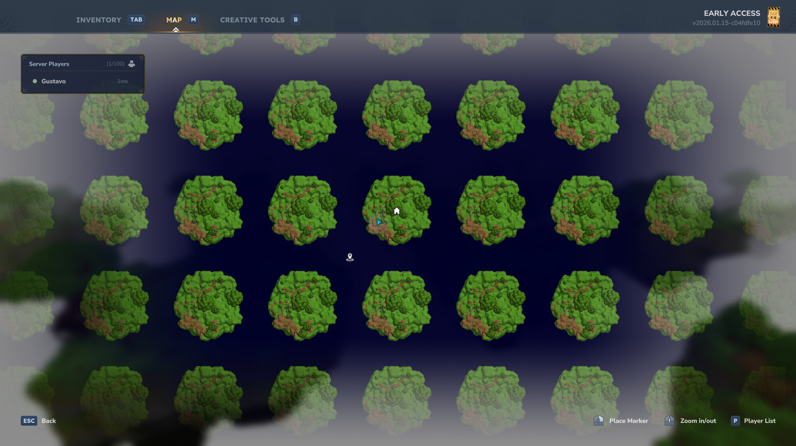

# Plots
**A dynamic prefab-based land management system. Define grids, load complex structures, and protect your world with intelligent masking.**

[See the Changelog](CHANGELOG.md)

A simple yet powerful way to manage creative spaces, allowing you to focus on what truly matters: building.

---

### Table of Contents
1. [Introduction](#plots)
2. [Installation](#installation)
3. [Dynamic Generation](#dynamic-generation)
4. [Showcase](#showcase)
5. [Configuration](#configuration)
6. [Quick Start](#quick-start)
7. [Commands](#commands)
8. [The Masking System](#the-masking-system)
9. [Permissions](#permissions)
10. [Localization](#localization)
11. [Data Architecture](#data-architecture)

---

## Installation
1. Place the `.jar` file in your mods folder.
2. (Optional) Add your `.prefab.json` files to `plugins/Hytale_Plots/prefabs/`.
3. Start the server to generate the default configuration.

## Dynamic Generation
Plots is not just a static grid. It adapts to your specific design.

*   **Adaptive Sizing**: The grid automatically adjusts to any road or plot width (whether 4 or 150 blocks wide).
*   **Islands Mode (Masking)**: Perfect for floating island worlds. The system understands your construction's shape and prevents expansions that deviate from the original design.
*   **Vacuum Protection**: Prevents players from joining separate islands or building in the "void," keeping your map's aesthetics intact.
*   **Non-Square Support**: Full support for independent width and depth (e.g., 32x64 plots).

## Showcase
Here is an example of what you can achieve **utilizing a custom prefab for the plot** within our dynamic system. These floating islands were generated automatically using the grid system and protected with our granular masking logic.


*A custom island plot structure generated from a prefab and perfectly integrated into the grid.*


*Top-down view showing how the plot prefab is distributed across the world.*


*Plot holograms displaying plot names and owners with configurable colors.*

## Configuration
The `config.json` allows total control over your world. Below is a breakdown of the main settings:

### General & World
*   **Language**: The locale used for messages (default: `en_us`).
*   **PlotWorldName**: The folder name for your dedicated plot world.
*   **DefaultWorldTime**: The starting time of the world (e.g., `midday`, `night`).

### Plots (Grid Settings)
*   **PlotSize**: The internal building area of each plot.
*   **RoadSize**: The width of the paths between plots. Set to `0` for a gapless grid.
*   **MaxPlotsDefault**: How many plots a player can claim by default.

### Blocks (Base Logic)
*   **Bedrock/Surface/Filling**: Define the base materials for your world generation.
*   **Pro Tip**: Set these to `Empty` or `Air` to create a technical "Void World" perfect for floating islands.

### Prefabs (The Core)
*   **Road/Plot/Intersection**: Links specific prefab designs to the grid.
*   **Important**: Use the filename **WITHOUT** the `.prefab.json` extension (e.g., use `my_island` for `my_island.prefab.json`).

## Quick Start
*   `/plot claim` - Take ownership of the plot you are standing on.
*   `/plot home` - Takes you back to your construction.
*   `/plot trust <player>` - Give a friend permission to build with you.
*   `/plot rename <name>` - Give your project a unique name.

## Commands
### Players
| Command | Description |
| :--- | :--- |
| `/plot claim` | Claims the current plot |
| `/plot auto` | Finds and claims the nearest free plot |
| `/plot home` | Teleports to your primary plot |
| `/plot trust <player>` | Grants build permission to another player |
| `/plot untrust <player>` | Revokes build permission from a player |
| `/plot info` | Shows details about the plot you are in |
| `/plot list` | Lists all your owned plots |
| `/plot spawn` | Teleports to the plot world spawn |

### Administration
| Command | Description |
| :--- | :--- |
| `/plot delete` | Removes a plot record (admins only) |
| `/plot reload` | Reloads configurations and prefabs |
| `/plot bypass` | Enables free-build mode for admins |

## The Masking System
We created an advanced protection logic for creative servers:
*   **Vacuum Respect**: If the space between islands isn't part of your original prefab, no one can build there. This maintains the "isolated island" look.
*   **Vertical Freedom**: If a column already contains ground from your prefab, the player is free to build up or down, allowing for basements or towers.
*   **Lower Limit**: Building below level 0 is automatically blocked to prevent visual clutter at the bottom of the map.

## Permissions
Plots uses a granular permission system. You can assign these nodes to players or groups:

### General Permissions
| Permission | Description |
| :--- | :--- |
| `plots.*` | Full administrative access (unlimited plots, bypass protection) |
| `plots.claim` | Allows claiming plots with `/plot claim` or `/plot auto` |
| `plots.delete` | Allows deleting owned plots with `/plot delete` |
| `plots.delete.*` | Allows deleting **any** plot (Administrator) |
| `plots.spawn` | Allows visiting the dedicated plot world with `/plot spawn` |
| `plots.list` | Allows listing owned plots with `/plot list` |
| `plots.info` | Allows viewing plot information with `/plot info` |
| `plots.rename` | Allows renaming plots with `/plot rename` |
| `plots.trust` | Allows managing trusted members with `/plot trust` |

### Limit Permissions
| Permission | Description |
| :--- | :--- |
| `plots.limit.X` | Sets the maximum number of plots a player can own (e.g., `plots.limit.5`) |

## Localization
We are committed to supporting as many languages as possible.
*   **Help us translate**: Visit our [Crowdin Project](https://crowdin.com/project/hytaleplots) to contribute.
*   Full message customization is available in the `lang/` directory within the plugin folder.

## Future Documentation
A more comprehensive and organized documentation site is currently under development. Stay tuned for advanced tutorials, API references, and design tips!

## Data Architecture
Everything is saved in simple, lightweight formats:
```
plugins/Hytale_Plots/
├── prefabs/                <- Your JSON designs
├── plots.json          <- Registry of all ownerships
└── config.json             <- General settings
```

---
---

## Hylograms Integration
Enhance your server with dynamic [Hylograms](https://www.curseforge.com/hytale/mods/hylograms) that automatically display plot information at the corner of each claimed plot.

*   **Dynamic Information**: Automatically shows the Plot Name and Owner's Name.
*   **Localized Text**: Uses your selected language for all hologram labels.
*   **Fully Configurable**: Toggle holograms on/off or adjust their height offset in `config.json`.
*   **Instant Updates**: Holograms update the moment a plot is renamed or transferred.

To enable this feature, simply include the `hylograms.jar` library in your server's `libs` or `mods` folder.
